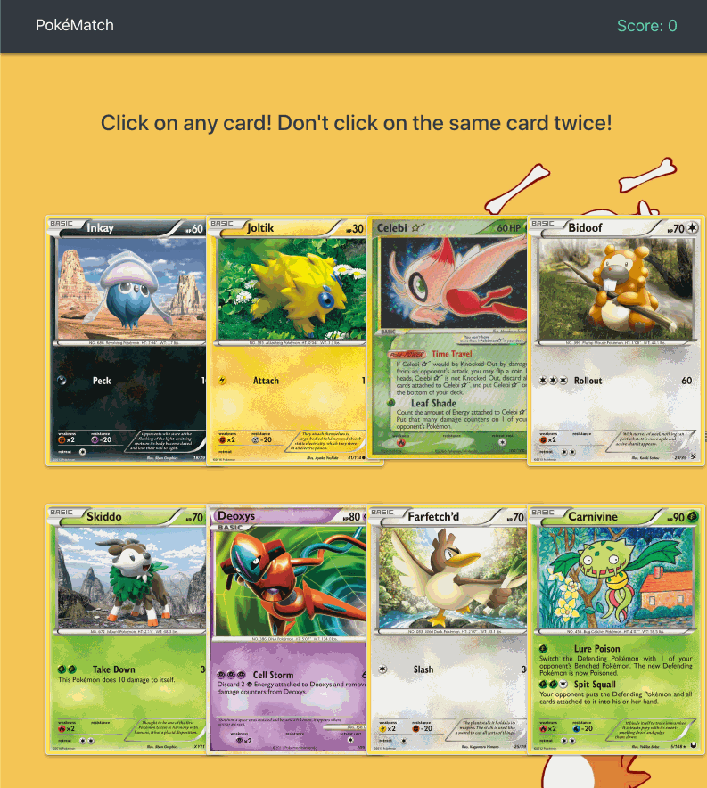

# PokeMatch! (React.js)
Demo: https://calm-falls-51776.herokuapp.com/

A memory Pokemon themed game. Click on any card but do not click on the same one twice! Built on React.js. This challenge was to teach me the concept of components, state, and props while exploring react UI libraries.

# Application
- `git clone <repo>`
- `npm install`
- Start dev: `npm start`

## Built on React

## Powered by React-Bootstrap, React-Materialize, React-Animate

# Technologies
- React.js
- npm react-bootstrap
- npm react-materialize
- npm react-animate-css
- Pokemontcg.io API